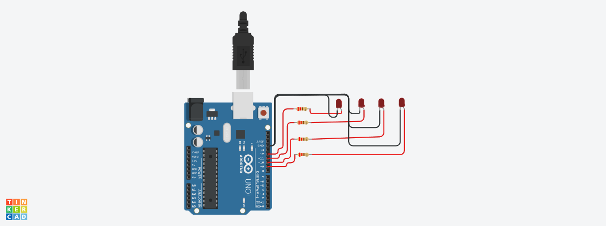

# Ejemplo Documentación Dojos

## Integrantes 
- Maximiliano Gomez
- Guido Gabriel Pascucci
- Martin Virum
- Ricardo Gonzalez
- Geronimo Camacho

## Proyecto: Sistema que mida temperatura con camara frigorifica.

## Descripción
La funcion del proyecto consiste en leer los valores de temperatura que da el sensor y activar los leds dependiendo de los valores que nos de

## Función principal
Esta funcion se encarga de leer el sensor de la temperatura y mostrar los datos por led y display de 7 segmentos.

SENSOR_TEMPERATURA es un #define que utilizamos para leer los valores del sensor de temperatura asociado al pin de arduino. La funcion map permite que los valores del sensor pasarlos a grado celcius.

~~~ c (lenguaje en el que esta escrito)
void loop()
{
  
  lecturaAnalogica = analogRead(SENSOR_TEMPERATURA);
  temperatura= map(lecturaAnalogica,20,358, -40, 125);
  Serial.print("La temperatura es : ");
  Serial.println(temperatura);
  
  
  if(temperatura>24)
  {
    printDigit('c');
    prenderLedRojo();
  } 
  else if(temperatura<0)
  {
    printDigit('f');
    prenderLedAzul();
  }
  else
  {
    printDigit('d');
  }
  
   
}

~~~

## :robot: Link al proyecto
- [proyecto](https://www.tinkercad.com/things/0U31T13dKQe-copy-of-empresa-frigorifica/editel?sharecode=Cw90pNXzL8RvYcMZEbBVsAhTxGaJD3d-tG8ycUFVjGc)
## :tv: Link al video del proceso
- [video](https://youtu.be/CsbndeN2B_U)

---
